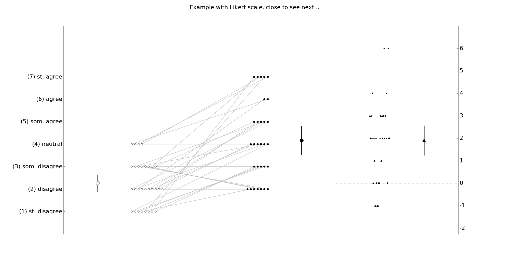

NEW STATISTICS FIGURES
=
This Python module generates plots in the style recommended by Geoff Cumming and others.
Please refer to [Understanding the New Statistics][1] and [Introduction to the New Statistics][2] for
a more details.

Version 1.0 [](https://zenodo.org/badge/latestdoi/80242479)
Version 1.1 [](https://doi.org/10.5281/zenodo.557127)

Citation
--
If this code was used to prepare figures for publications, presentations, books, etc., please cite this code as:

**Version 1.0**
Héroux ME (2017). Cumming plot (paired data) for Python. DOI: 10.5281/zenodo.265186. 

**Version 1.1**
Héroux ME (2017). Cumming plot (paired data) for Python. DOI: 10.5281/zenodo.557127. 


Description
--
The current version of the module includes the function `paired()` to 
plot paired data. Future versions will include a function to plot 
unpaired data.

This style of figure depicts all of the data, the summary statistics 
associated with this data (mean, SD or 95% CI). Raw differences of the 
paired data and the inferential statistics associated with these 
differences are plotted on a separate y-axis. 

Usage
--
**From the command line:**

Print usage
>$ python cumming_plot.py 

Plot data from file

>$ python cumming_plot.py data.txt

Plot series of sample plots (same as below)
>$ python cumming_plot.py examples

**From python program**
```
import cumming_plot
from random import randint
start = [randint(1, 4) for i in range(30)]
end = [randint(2, 7) for i in range(30)]
data = [start, end]
# Simple plot
import matplotlib.pyplot as plt
fig = plt.figure()
ax = fig.add_subplot(111)
cumming_plot.paired(data, ax)
plt.show()

```
Examples
--

**Generate fake data**

```
import cumming_plot
from random import randint
start = [randint(1,4) for i in range(30)]
end = [randint(2,7) for i in range(30)]
data = [start, end]
```

**Simple plot**
```
import matplotlib.pyplot as plt
fig = plt.figure()
ax = fig.add_subplot(111)
cumming_plot.paired(data, ax)
plt.show()
```


**Complex plot**
```
ab_errors = 'SD'
yticks = [-10, 30, 10]
style = {'a': ['r*', 'k'], 'b':['yo', 'g'], 'diff': ['w^', 'm']}
ylabel = 'y label'
xlabel = ['start', 'end', 'dif']
zero_line = True
y2label = 'y2 difference axis'
y2ticks = True
cumming_plot.paired(data, ax, ab_errors=ab_errors, yticks=yticks,
                  style=style, ylabel=ylabel, xlabel=xlabel,
                  zero_line=zero_line, y2label=y2label,
                  y2ticks=y2ticks)
```


**Plot Likert data**
```
start = [randint(1,4) for i in range(30)]
end = [randint(2,7) for i in range(30)]
data = [start, end]
fig = plt.figure()
ax = fig.add_subplot(1,1,1)
cumming_plot.paired(data, ax, y2ticks=True, likert=True)
plt.show()
```



**Generate crazy example**
```
style1 = {'a': ['bo', 'b'], 'b': ['ro', 'r'], 'diff': ['g^', 'g']}
style2 = {'a': ['b8', 'm'], 'b': ['yd', 'r'], 'diff': ['cp', 'k']}
style3 = {'a': ['g*', 'k'], 'b': ['y*', 'b'], 'diff': ['cv', 'm']}
style4 = {'a': ['rh', 'b'], 'b': ['mp', 'b'], 'diff': ['sk', 'y']}
style5 = {'a': ['ko', 'b'], 'b': ['bo', 'r'], 'diff': ['gs', 'b']}
style6 = {'a': ['y+', 'g'], 'b': ['kd', 'k'], 'diff': ['mx', 'b']}
style7 = {'a': ['g^', 'r'], 'b': ['m*', 'r'], 'diff': ['r<', 'k']}
style8 = {'a': ['mo', 'c'], 'b': ['cp', 'b'], 'diff': ['y>', 'm']}

styles = [style1, style2, style3, style4, style5, style6, style7, style8]

fig = plt.figure()
subplots = range(1,9)

for i, subplot in enumerate(subplots):
    # Set subplot parameters
    ab_errors = choice(['SD', '95%CI'])
    yticks = choice([[-10, 30, 10], [-10, 40, 5], 'default'])
    style = styles[i]
    ylabel = choice(['y label', 'amplitude (cm)', 'volume (L)', None])
    xlabel = choice([['START', 'END', 'diff'], ['ME', 'ME2', '2'], None])
    zero_line = choice([True, False])
    y2label = choice(['y2 difference axis', 'difference', None])
    y2ticks = choice([True, False])

    # Generate fake data
    n = randint(5, 50)
    a = [randint(10, 21) for i in range(n)]
    b = [randint(0, 15) for i in range(n)]
    ab = [a, b]

    # Generate subplot
    ax = fig.add_subplot(4, 2, subplot)
    paired(ab, ax, ab_errors=ab_errors, yticks=yticks,
            style=style, ylabel=ylabel, xlabel=xlabel,
            zero_line=zero_line, y2label=y2label,
            y2ticks=y2ticks)
#plt.tight_layout()
plt.suptitle('Crazy example, close to finish.')
plt.show()
```


[1]: https://www.routledge.com/Understanding-The-New-Statistics-Effect-Sizes-Confidence-Intervals-and/Cumming/p/book/9780415879682  
Cumming G (2012). Understanding the New Statistics: Effect Sizes, Confidence Intervals, and	Meta-Analysis. Routledge, East Sussex.

[2]: https://www.routledge.com/Introduction-to-the-New-Statistics-Estimation-Open-Science-and-Beyond/Cumming-Calin-Jageman/p/book/9781138825529
Cumming G & Calin-Jageman R (2017). Introduction the New Statistics: Estimation, Open Science & Beyond. Routledge, East Sussex.
